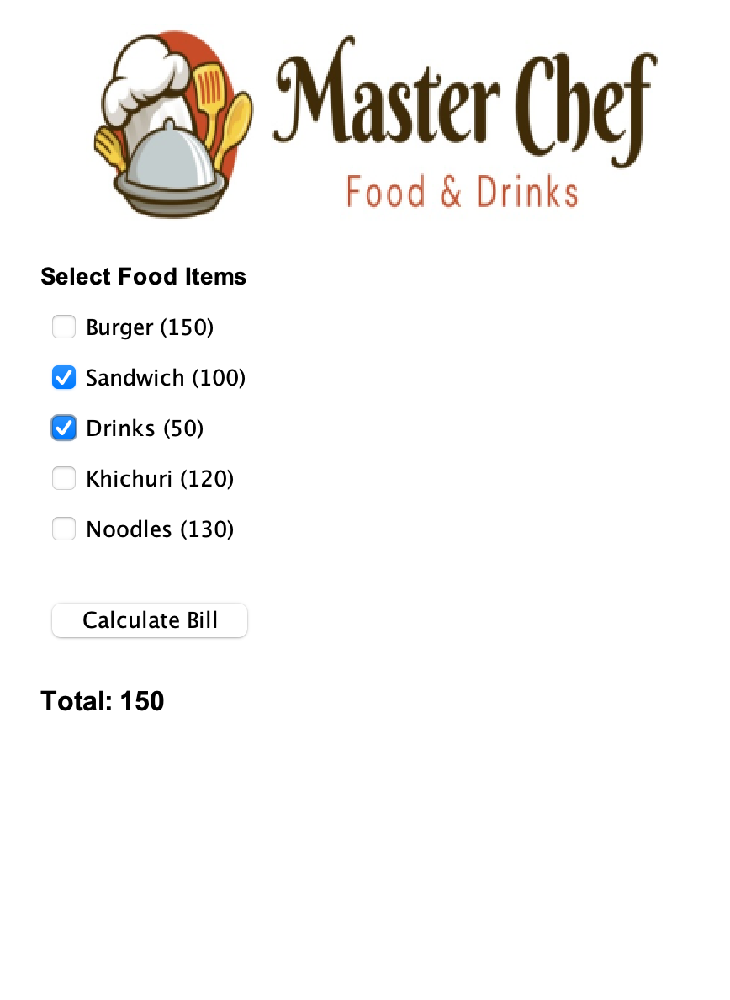

# 🍽️ Canteen Management System

[](https://www.java.com/) 
[](https://docs.oracle.com/javase/8/docs/technotes/guides/swing/) 
[](https://en.wikipedia.org/wiki/Object-oriented_programming)

A simple **Java Swing–based desktop application** designed to calculate food bills for a canteen.  
The application follows **Object-Oriented Programming (OOP)** principles such as **Inheritance, Polymorphism, Abstraction, and Interfaces**.

---

## 📑 Table of Contents

- [Preview](#-preview)  
- [Technologies Used](#-technologies-used)  
- [Project Structure](#-project-structure)  
- [Features](#-features)  
- [Menu & Pricing](#-menu--pricing)  
- [How to Run](#-how-to-run)  
- [Author](#-author)  
- [License](#-license)  

---

## 📸 Preview



---

## 🛠️ Technologies Used

- **Java (Core Language)**  
- **Java Swing** – GUI components (`JFrame`, `JPanel`, `JCheckBox`, `JButton`)  
- **Java AWT** – Layouts and event handling  
- **Object-Oriented Programming (OOP)**  

---

## 📂 Project Structure

```text
canteen-management-system/
├── Payment.java      # Interface defining the price calculation contract
├── Food.java         # Abstract base class for all food items
├── Burger.java       # Food item class (150 TK)
├── Sandwich.java     # Food item class (100 TK)
├── Drinks.java       # Food item class (50 TK)
├── Khichuri.java     # Food item class (120 TK)
├── Noodles.java      # Food item class (130 TK)
├── Canteen.java      # Main GUI frame, checkbox handling, and event logic
├── Start.java        # Application entry point (main method)
└── canteen.jpeg      # Banner image used in the GUI 
```
---
## 🚀 Features

- GUI Interface built using Java Swing and AWT
- Menu Selection using multiple checkboxes
- Dynamic Bill Calculation on button click
- Interactive UI with hover effects using MouseListener
- Clean OOP Design using abstraction and interfaces

---

## 📋 Menu & Pricing

| Item      | Price (TK) |
|-----------|------------|
| Burger    | 150        |
| Sandwich  | 100        |
| Drinks    | 50         |
| Khichuri  | 120        |
| Noodles   | 130        |

---

## ⚙️ How to Run

1. **Compile the files**
```bash
javac *.java
```

2. **Run the application**

```bash
java Start
```
---

## 👤 Author

Yousuf Humran

---


## 📄 License

This project is open source and available for educational and personal use.